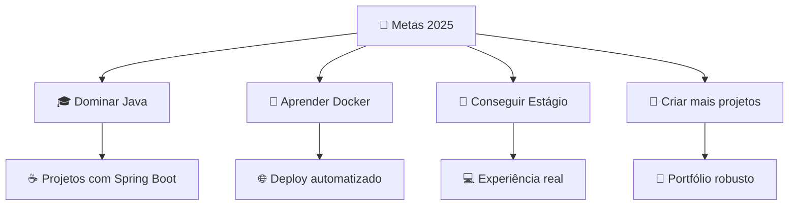

<div align="center">

#  Olá! Eu sou o Amilton Junior

### 🚀 Indie Hacker | Backend Developer | Estudante de ADS

[](https://git.io/typing-svg)

</div>

---

## 🧑‍💻 Sobre Mim

```python
class AmiltonJunior:
    def __init__(self):
        self.nome = "Amilton Junior Da Costa Monteiro"
        self.cargo = "Estudante de ADS & Futuro Backend Developer"
        self.universidade = "UCL - 2º Período"
        self.status = "Em busca do primeiro estágio"
        self.mindset = "Regressão à média - tudo se equilibra"
        self.indie_hacker = True
        
    def tecnologias_atuais(self):
        return {
            "backend": ["Python", "Flask", "Django"],
            "banco_dados": ["MySQL"],
            "frontend": ["HTML", "CSS", "JavaScript"],
            "ferramentas": ["Git", "VS Code", "Power BI"],
            "estudando": ["Java", "Docker", "JavaScript Avançado"]
        }
        
    def hobbies(self):
        return ["💰 Mercado Financeiro", "🏐 Vôlei", "💪 Academia", "🏃‍♂️ Esportes"]
        
    def objetivo_2025(self):
        return "Dominar novas tecnologias e conquistar meu primeiro estágio!"
```

---

## 🔥 Minha Jornada


- 🔭 **Atualmente trabalhando em:** Sistema Escolar para Transporte (Python + MySQL)
- 🌱 **Aprendendo:** Java, Docker e JavaScript Avançado
- 👯 **Procurando colaborar em:** Projetos open source e sistemas web
- 🤝 **Preciso de ajuda com:** Boas práticas em arquitetura de software
- 💬 **Me pergunte sobre:** Python, Flask, Power BI, Mercado Financeiro
- ⚡ **Curiosidade:** Já criei sistemas para microempreendedores locais!

---

## 🛠️ Tech Stack

<div align="center">

### 💻 Linguagens


### 🗄️ Banco de Dados


### 🚀 Frameworks & Bibliotecas


### 🛠️ Ferramentas


### 📚 Estudando


</div>

---

## 📊 GitHub Stats

<div align="center">
  
  
</div>

<div align="center">
  
</div>

---

## 🏆 Projetos em Destaque

<div align="center">

### 🚌 Sistema de Gestão para Transporte Escolar
[](https://github.com/Juniorc027/Projeto_Transporte2)

**Tecnologias:** Python • MySQL • Flask • HTML • CSS

✨ **Funcionalidades:**
- 📋 Cadastro e controle de alunos, escolas e responsáveis
- 📊 Geração de relatórios de frequência e pagamentos  
- 🎨 Interface web responsiva e intuitiva
- 💰 Controle financeiro integrado

</div>

### 💼 Sistema de Agendamento para Barbearia
**Projeto Privado - Solução Real para Microempreendedor**

🔧 **Tecnologias:** Python • HTML • CSS • JavaScript  
🎯 **Objetivo:** Automatizar agendamentos e controle de clientes  
📈 **Impacto:** Otimizou o processo de agendamento em 70%

---

## 🎯 Meus Objetivos para 2025



---

## 🌟 Certificações

<div align="center">

| 🏆 Certificação | 🏢 Instituição | 📅 Ano |
|---|---|---|
| Power BI Completo – Do Básico ao Avançado | Udemy | 2025 |
| Excel Intermediário | Fundação Bradesco | 2025 |
| Introdução ao Python | Curso Livre | 2024 |

</div>

---

## 🎮 Hobbies & Interesses

<div align="center">

| 💰 Mercado Financeiro | 🏐 Vôlei | 💪 Academia | 🏃‍♂️ Esportes |
|---|---|---|---|
| Investimentos | Jogos semanais | Treinos regulares | Atividade física |
| Análise técnica | Competições | Musculação | Bem-estar |

</div>

---

## 🤝 Vamos Conectar?

<div align="center">

[](https://www.linkedin.com/in/amilton-junior-92a2592b0)
[](mailto:amiltonjuniorcosta25@gmail.com)
[](https://github.com/Juniorc027)

</div>

---

<div align="center">

### 🎵 Meu Lema de Vida
> *"Regressão à média - nada fica ruim para sempre, nada fica bom para sempre.  
> A balança sempre se equilibra, então continue seguindo em frente!"*

---


**⭐ Se você chegou até aqui, que tal dar uma estrela nos meus repositórios? 😉**

</div>

<!-- Workflow para blog posts -->
# 📝 Últimos Posts
<!-- BLOG-POST-LIST:START -->
<!-- BLOG-POST-LIST:END -->
