```mermaid
graph TD
    A[🯠Metas 2025] --> B[📠Dominar Java]
    A --> C[🳠Aprender Docker]
    A --> D[💼 Conseguir Estágio]
    A --> E[🚀 Criar mais projetos]
    B --> F[☕ Projetos com Spring Boot]
    C --> G[🌠Deploy automatizado]
    D --> H[💻 Experiência real]
    E --> I[🌟 Portfólio robusto]
```

#  Olá! Eu sou o Amilton Junior

### 🚀 Indie Hacker | Backend Developer | Estudante de ADS

---

## 🧑‍💻 Sobre Mim

🎓 Me chamo **Amilton Junior Da Costa Monteiro**, estudante de **ADS (2º período)** na **UCL**.  
🚀 Atualmente focado em me tornar um **Backend Developer** e conseguir meu primeiro estágio.  
👨‍💻 Indie Hacker, apaixonado por resolver problemas com código. 

---

## 🔥 Minha Jornada

- 🔭 **Atualmente trabalhando em:** Sistema Escolar para Transporte (Python + MySQL)
- 🌱 **Aprendendo:** Java, Docker e JavaScript Avançado
- 👯 **Procurando colaborar em:** Projetos open source e sistemas web
- 🤝 **Preciso de ajuda com:** Boas práticas em arquitetura de software
- 💬 **Me pergunte sobre:** Python, Flask, Power BI, Mercado Financeiro
- ⚡ **Curiosidade:** Já criei sistemas para microempreendedores locais!

---

## 🛠️ Tech Stack

  
  
  
  
  
  
  
  
  
  

  <strong>📚 Estudando:</strong> 
  
  

---

## 📊 GitHub Stats

  
  

  

---

## 🏆 Projetos em Destaque

### 🚌 Sistema de Gestão para Transporte Escolar

**Tecnologias:** Python • MySQL • Flask • HTML • CSS

✨ **Funcionalidades:**
- 📋 Cadastro e controle de alunos, escolas e responsáveis
- 📊 Geração de relatórios de frequência e pagamentos  
- 🎨 Interface web responsiva e intuitiva
- 💰 Controle financeiro integrado

### 💼 Sistema de Agendamento para Barbearia
**Projeto Privado - Solução Real para Microempreendedor**

🔧 **Tecnologias:** Python • HTML • CSS • JavaScript  
🎯 **Objetivo:** Automatizar agendamentos e controle de clientes  
📈 **Impacto:** Otimizou o processo de agendamento em 70%

---

## 🎯 Meus Objetivos para 2025

---

## 🌟 Certificações

| 🏆 Certificação | 🏢 Instituição | 📅 Ano |
|---|---|---|
| Power BI Completo – Do Básico ao Avançado | Udemy | 2025 |
| Excel Intermediário | Fundação Bradesco | 2025 |
| Introdução ao Python | Curso Livre | 2024 |

---

## 🎮 Hobbies & Interesses

| 💰 Mercado Financeiro | 🏐 Vôlei | 💪 Academia | 🏃‍♂️ Esportes |
|---|---|---|---|
| Investimentos | Jogos semanais | Treinos regulares | Atividade física |
| Análise técnica | Competições | Musculação | Bem-estar |

---

## 🎵 Inspiração
> *"The only way to do great work is to love what you do."*  
> — Steve Jobs

✨ Levo essa frase comigo porque acredito que a paixão é o motor da excelência.  
Cada linha de código, cada projeto, é uma oportunidade de crescer, aprender e me aproximar do futuro que estou construindo na tecnologia.

---

## 🤝 Vamos Conectar?

---

**⭐ Se você chegou até aqui, que tal dar uma estrela nos meus repositórios? 😉**

<!-- Workflow para blog posts -->
# 📝 Últimos Posts
<!-- BLOG-POST-LIST:START -->
<!-- BLOG-POST-LIST:END -->
